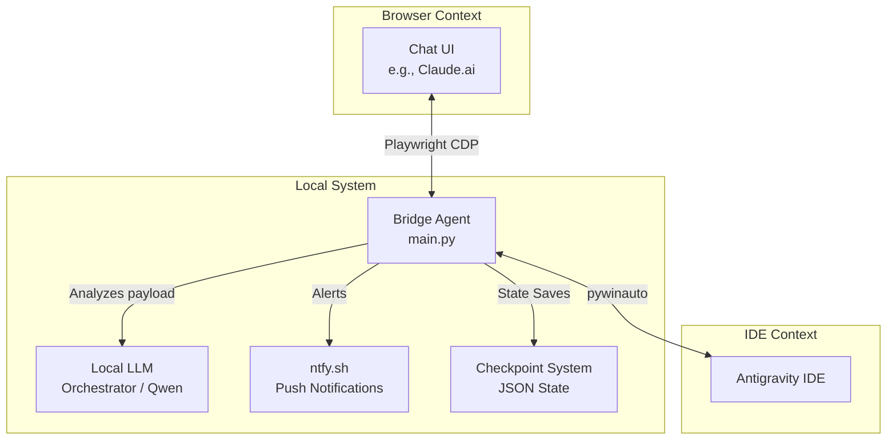

# 🌉 Bridge Agent

> Zero-cost, local, unattended automation that replaces manual copy-paste between the Antigravity IDE and a browser-based AI chat (like Claude or ChatGPT) using a local LLM orchestrator.

## 📖 Overview

The **Bridge Agent** acts as an intelligent intermediary. Instead of manually copying prompts from an architect LLM in a browser and pasting them into the Antigravity IDE (and vice versa), this agent fully automates the loop. 

It uses **Playwright** to hook into your browser's Chat UI, **pywinauto** to interact with the Antigravity IDE, and a local **Ollama-powered LLM** (acting as an Orchestrator) to analyze messages, detect errors, and control the flow of the conversation.

---

## 🏗️ Architecture

The system is built on a 3-Phase state machine, constantly evaluating the context of the conversation to know when to pass the baton between the Architect (Chat UI) and the Coder (Antigravity).



### Core Components
- **`main.py`**: The central loop orchestrator managing the state machine.
- **`chat_driver.py`**: Interacts with the browser via Chrome Debugging Protocol (CDP) and Playwright. Handles rate limit detection and message extraction.
- **`antigravity_driver.py`**: Interfaces with the Antigravity IDE using UI Automation (`pywinauto`).
- **`orchestrator.py`**: A local LLM that analyzes every message passing through the bridge to catch errors and determine the current phase.
- **`checkpoint.py`**: State persistence. If the script crashes or is paused, it resumes exactly where it left off.
- **`notifier.py`**: Sends push notifications to your phone (via ntfy) when manual intervention is needed (e.g., rate limits, hard errors).

---

## ⚙️ The 3-Phase State Machine

1. **Phase 1: Planning (Chat UI)**
   The Bridge sends the initial user task to the Chat UI. The Chat UI acts as the "Architect", generating a premium, detailed project brief and the first implementation step.
2. **Phase 2: Plan Execution (Antigravity)**
   The Bridge extracts the Architect's brief and forwards it to the Antigravity IDE. The IDE acts as the "Coder", executing the step and reporting its progress.
3. **Phase 3: The Review Loop**
   The core loop. The IDE's output is sent back to the Architect for review. The Architect provides the next step, which is sent back to the IDE. This ping-pong continues until a `DONE` token is reached.

---

## ✨ Key Features

- 🔄 **Fully Unattended Loop**: Let complex architectures build themselves while you step away.
- 🚦 **Rate Limit Resilience**: Automatically detects "usage limit reached" messages, pauses the bridge, and alerts your phone.
- 💾 **State Checkpointing**: Safely interrupt with `Ctrl+C`. The agent saves its turn, phase, and payload history to resume seamlessly later.
- 📱 **Mobile Push Notifications**: Uses `ntfy.sh` to ping your phone on errors, rate limits, or clean completion.
- 🛡️ **Anti-Bot Delays**: Randomized human-like typing delays to prevent browser automation blocking.

---

## 🚀 Setup & Installation

### 1. Prerequisites
- [Python 3.10+](https://www.python.org/downloads/)
- [Ollama](https://ollama.com/) installed locally.
- Google Chrome or Chromium browser.

### 2. Install Dependencies
Navigate to the directory and install the required packages:

```bash
cd bridge_agent
pip install -r requirements.txt
playwright install chromium
```

### 3. Setup Local LLM
Pull the orchestrator model via Ollama (configured to `qwen2.5-coder:latest` by default):

```bash
ollama pull qwen2.5-coder:latest
```

### 4. Chrome CDP Setup
The bridge connects to your existing browser session to avoid logging in repeatedly. You must launch Chrome with remote debugging enabled. 

**Windows Example:**
```powershell
Start-Process "chrome.exe" -ArgumentList "--remote-debugging-port=9222"
```

---

## 🔧 Configuration

All configurable parameters live in `config.py`.

1. **Antigravity Window**: Run `python inspect_antigravity.py` to find the exact window title regex of your IDE instance and update `ANTIGRAVITY_WINDOW_TITLE`.
2. **Chat Selectors**: Open your target chat (Claude/ChatGPT), inspect the DOM, and update `CHAT_SELECTORS` with the correct CSS selectors for the input box. You can use `python find_selectors.py` to help identify them.
3. **Notifications**: Pick an unguessable string for `NTFY_TOPIC`. Download the [ntfy app](https://ntfy.sh/) on iOS/Android and subscribe to that topic.

---

## 🎮 Usage

1. Ensure Chrome is running with `--remote-debugging-port=9222` and you are logged into your Chat UI (e.g., Claude.ai).
2. Ensure Ollama is running in the background.
3. Start the Bridge Agent:

```bash
python main.py "Create a beautiful React dashboard with a dark mode toggle"
```

4. Watch the terminal as the bridge handles the communication loop!
